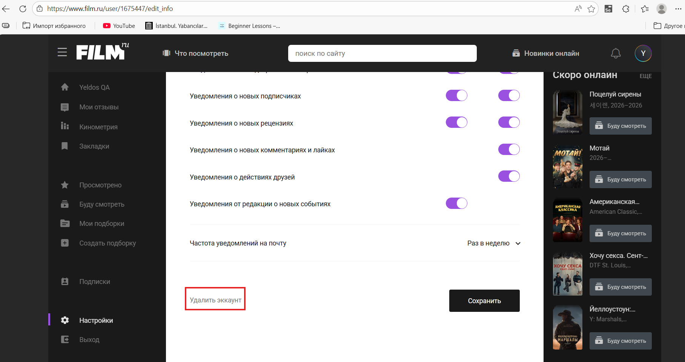

# filmru – Bug Report №9

## ID: FBR-009

## Title:
- Spelling error in profile settings

## Description:
- When you go to the "Настройки" (Settings) section, scroll down to the bottom of the page, you'll see "Удалить эккаунт" (Delete account) button. It should be "Удалить аккаунт".

## Environment:
- OS: Windows 11;
- Browser: Microsoft Edge (version 145.0.3800.70).

## Steps:
1. Open the “film.ru” website and sign in;
2. Click on the profile icon;
3. Click on the “Настройки” (Settings) button;
4. Scroll down to the bottom of the page.

## Expected Result:
- The button label is spelled correctly: “Удалить аккаунт”.

## Actual Result:
- There is the “Удалить эккаунт” button.

## Severity:
- Trivial.

## Priority:
- Minor.

## Evidence:

### Screenshot:

