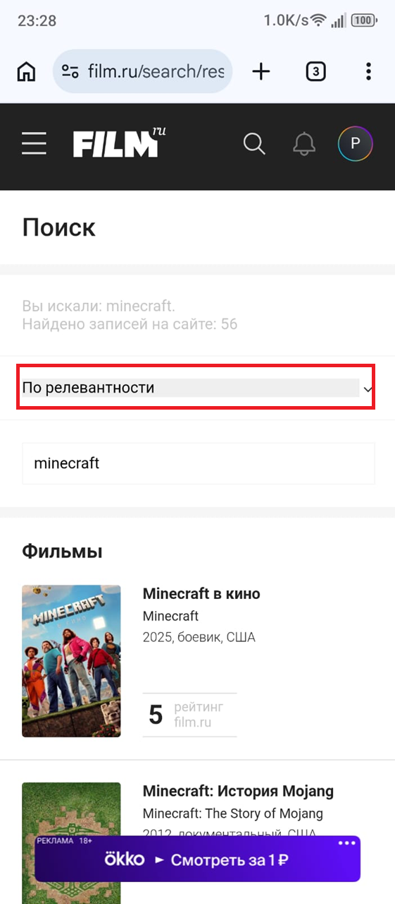

# filmru – Bug Report №12

## ID: FBR-012

## Title:
- Missing search parameters in mobile version

## Description:
- On the mobile version of the site, the search bar does not provide the same parameters as on desktop. Options such as “Все страницы” (All pages), “Фильмы” (Movies), “Фильмы онлайн” (Movies online), “Люди” (People), “Публикации” (Publications), “Новости” (News), and “Игры” (Games) are absent. Only “По релевантности” (By relevance), “По дате” (By date), and “По алфавиту” (Alphabetical) are available.

## Environment:
- OS: Android 13;
- Browser: Chrome (version 145.0.7632.120).

## Steps:
1. Open the “film.ru” website on a mobile device;
2. Tap on the search bar and type any values;
3. Observe the available parameters.

## Expected Result:
- Search bar provides the same parameters as on desktop (All pages, Movies, Movies online, People, Publications, News, Games).

## Actual Result:
- Only three parameters are available: By relevance, By date, Alphabetical.

## Severity:
- Medium.

## Priority:
- Normal.

## Evidence:

### Screenshot 1:

### Screenshot 2:

